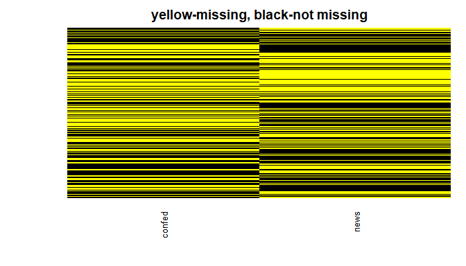
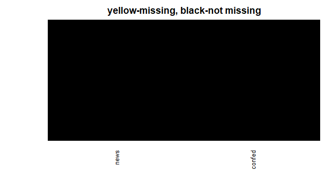
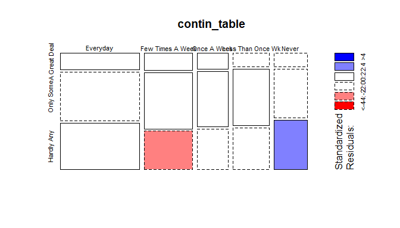

## Setup

### Load packages


```r
library(ggplot2)
library(dplyr)
library(statsr)
```

### Load data


```r
load("gss.Rdata")
```


* * *

## Part 1: Data
The GSS data has been through  interviews . The data has been collected through random sampling . As the survey is conducted by random sampling, the results from the survey or rather the inferences drawn from this survey can be generalized to the entire US population.

* * *

## Part 2: Research question
To check whether there is a association between reading newspapers and confidence level in goverment. SInce the data has a specific branch of government , i would like to check whether reading newpaper associates with people's confidence in the executive branch of federal government.

Newspapers are a part of the daily lives of almost all the people. Hence, testing whether reading newspapers affect people's confidence in gov. would be a good thing to explore .
 

* * *

## Part 3: Exploratory data analysis

Lets only talk about the 21st century data.

```r
summary(gss$year)
```

```
##    Min. 1st Qu.  Median    Mean 3rd Qu.    Max. 
##    1972    1983    1993    1992    2002    2012
```

```r
dataset<-gss%>%filter(year>=2000)

dataset$year%>%summary()
```

```
##    Min. 1st Qu.  Median    Mean 3rd Qu.    Max. 
##    2000    2002    2006    2005    2008    2012
```


```r
dataset %>% select(news) %>% table()
```

```
## .
##          Everyday  Few Times A Week       Once A Week Less Than Once Wk 
##              3603              2318              1555              1560 
##             Never 
##              1439
```
It seems like majority people read newspaper everday which indeed is a good thing.
Lets see how much NA values does our concerned columns have.

NOTE:- NULL VALUES WOULD NOT EFFECT THIS CASE BUT CLEANING DATA IS GOOD PRACTICE IN MY ACCORDANCE.

```r
any(is.na(dataset))
```

```
## [1] TRUE
```

```r
library(Amelia)
```

```
## Loading required package: Rcpp
```

```
## ## 
## ## Amelia II: Multiple Imputation
## ## (Version 1.7.5, built: 2018-05-07)
## ## Copyright (C) 2005-2018 James Honaker, Gary King and Matthew Blackwell
## ## Refer to http://gking.harvard.edu/amelia/ for more information
## ##
```

```r
colnames(dataset)
```

```
##   [1] "caseid"   "year"     "age"      "sex"      "race"     "hispanic"
##   [7] "uscitzn"  "educ"     "paeduc"   "maeduc"   "speduc"   "degree"  
##  [13] "vetyears" "sei"      "wrkstat"  "wrkslf"   "marital"  "spwrksta"
##  [19] "sibs"     "childs"   "agekdbrn" "incom16"  "born"     "parborn" 
##  [25] "granborn" "income06" "coninc"   "region"   "partyid"  "polviews"
##  [31] "relig"    "attend"   "natspac"  "natenvir" "natheal"  "natcity" 
##  [37] "natcrime" "natdrug"  "nateduc"  "natrace"  "natarms"  "nataid"  
##  [43] "natfare"  "natroad"  "natsoc"   "natmass"  "natpark"  "confinan"
##  [49] "conbus"   "conclerg" "coneduc"  "confed"   "conlabor" "conpress"
##  [55] "conmedic" "contv"    "conjudge" "consci"   "conlegis" "conarmy" 
##  [61] "joblose"  "jobfind"  "satjob"   "richwork" "jobinc"   "jobsec"  
##  [67] "jobhour"  "jobpromo" "jobmeans" "class"    "rank"     "satfin"  
##  [73] "finalter" "finrela"  "unemp"    "govaid"   "getaid"   "union"   
##  [79] "getahead" "parsol"   "kidssol"  "abdefect" "abnomore" "abhlth"  
##  [85] "abpoor"   "abrape"   "absingle" "abany"    "pillok"   "sexeduc" 
##  [91] "divlaw"   "premarsx" "teensex"  "xmarsex"  "homosex"  "suicide1"
##  [97] "suicide2" "suicide3" "suicide4" "fear"     "owngun"   "pistol"  
## [103] "shotgun"  "rifle"    "news"     "tvhours"  "racdif1"  "racdif2" 
## [109] "racdif3"  "racdif4"  "helppoor" "helpnot"  "helpsick" "helpblk"
```

```r
missmap(dataset[,c(52,105)],main = "yellow-missing, black-not missing",legend = F,col = c("yellow","black"),y.at = c(1),y.labels = c(''))
```

<!-- -->
Since we are dealing with categorical variables, we cannot replace these values with mean . So we may remove these.


```r
df<-dataset %>% filter(!is.na(news)) %>% filter(!is.na(confed))
missmap(df[,c(52,105)],main = "yellow-missing, black-not missing",legend = F,col = c("yellow","black"),y.at = c(1),y.labels = c(''))
```

<!-- -->

```r
table(df$news)
```

```
## 
##          Everyday  Few Times A Week       Once A Week Less Than Once Wk 
##              1661              1011               647               754 
##             Never 
##               698
```

Lets see how many people have confidence on the federal section of the government


```r
table(df$confed)
```

```
## 
## A Great Deal    Only Some   Hardly Any 
##          682         2243         1846
```
Hmmm.., that looks like most of the people donot have much confidence on this gov section.

Lets visualize the distribution among news and confidence.

```r
contin_table=table(df$news,df$confed)
mosaicplot(contin_table,shade = T)
```

<!-- -->
It seems that people who read news papers don't trust the gov.'s section.

* * *

## Part 4: Inference

Since I are dealing with multiple factors and I want to test independence, I would use the chi-square test. 

My null hypthesis would be- There is no relation between reading newspapers and having confidence on the government's federal section.

Alternale hypothesis - There is indeed a  relation between reading newspapers and having confidence on the government's federal section.


```r
chisq.test(x = df$news,y = df$confed)$expected
```

```
##                    df$confed
## df$news             A Great Deal Only Some Hardly Any
##   Everyday             237.43492  780.8893   642.6757
##   Few Times A Week     144.51939  475.3035   391.1771
##   Once A Week           92.48669  304.1754   250.3379
##   Less Than Once Wk    107.78202  354.4796   291.7384
##   Never                 99.77699  328.1522   270.0708
```
Observed:-


```r
table(df$news,df$confed)
```

```
##                    
##                     A Great Deal Only Some Hardly Any
##   Everyday                   249       727        685
##   Few Times A Week           158       508        345
##   Once A Week                 94       321        232
##   Less Than Once Wk           94       382        278
##   Never                       87       305        306
```

Conductiong the test:-


```r
chisq.test(x = df$news,y = df$confed)
```

```
## 
## 	Pearson's Chi-squared test
## 
## data:  df$news and df$confed
## X-squared = 30.921, df = 8, p-value = 0.0001451
```

The obtained test statistic is 30.921 with a p-value 0.0001451. Since, p<0.05, we would reject the null- hypothesis .

Hence, there indeed is a relationship between reading newspapers and having confidence on the federal section of the government.


